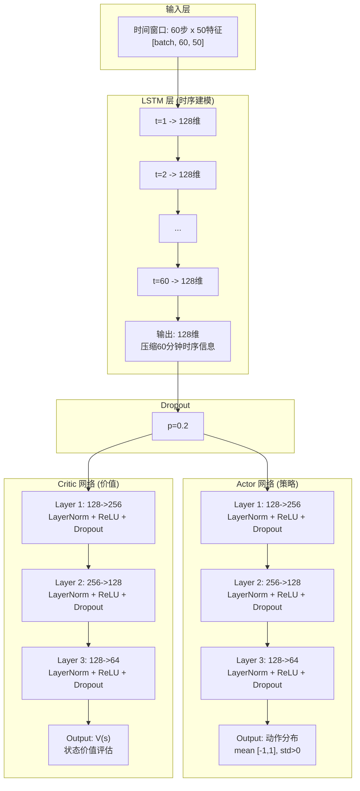

<div align="center">
  
</div>

<p align="center">
  <a href="docs/ARCHITECTURE.md"></a>
  
  
  
  
  
  
  
  
</p>

---

基于 PPO + LSTM 的加密货币分钟级交易决策系统，支持多币种策略学习与回测。

## 项目背景

加密货币市场具有高波动性、7x24 小时连续交易的特点，传统技术分析方法难以应对复杂的非线性价格行为。本项目采用深度强化学习技术，让智能体通过与环境交互自动学习交易策略。

**为什么选择 PPO + LSTM：**

| 方案 | 优势 |
|------|------|
| PPO (Proximal Policy Optimization) | 策略梯度方法中稳定性最好，适合连续动作空间，不会出现策略更新过大导致的崩溃 |
| LSTM (Long Short-Term Memory) | 能够记忆长期时序依赖，捕捉价格趋势和周期性模式 |
| Actor-Critic 架构 | Actor 负责决策，Critic 负责评估，两者协同提升学习效率 |

**适用场景：** 分钟级至小时级的中频量化交易，支持多币种组合策略。

## 核心特性

| 特性 | 说明 |
|------|------|
| PPO 算法 | 稳定的策略梯度方法，适合连续动作空间 |
| LSTM + MLP | 捕捉时序依赖 + 特征提取 |
| 分钟级决策 | 适用于中频交易场景 |
| 多币种支持 | 可同时交易多个加密货币 |
| 完整回测 | 内置回测引擎和评估指标 |

## 项目结构

```
crypto_trading_agent/
├── config/           # 配置模块
├── data/             # 数据模块 (OKX 数据源)
├── envs/             # 交易环境 (Gymnasium)
├── agents/           # PPO 智能体 + 网络结构
├── training/         # 训练器 + 回调
├── evaluation/       # 回测 + 指标 + 可视化
├── inference/        # 预测器 + 风险管理
├── scripts/          # 命令行脚本
├── tests/            # 测试
└── docs/             # 文档
```

## 快速开始

### 安装

```bash
pip install -r requirements.txt
```

### 下载数据

```bash
python scripts/download_okx_data.py \
    --symbols BTC-USDT ETH-USDT \
    --start 2024-01-01 \
    --end 2024-03-31 \
    --bar 1m \
    --output ./data/okx
```

### 训练

```bash
python scripts/train.py --config config/okx.yaml
```

### 回测

```bash
python scripts/backtest.py --model models/best_model.pt --data data/test.csv
```

### 评估

```bash
python scripts/evaluate.py --model models/best_model.pt
```

## 网络架构



### 层级参数表

| 模块 | 层 | 输入维度 | 输出维度 | 激活函数 | Dropout |
|------|-----|---------|---------|---------|---------|
| **LSTM** | - | 50 | 128 | Tanh/Sigmoid | 0.1 |
| **Actor** | Layer 1 | 128 | 256 | ReLU | 0.2 |
| | Layer 2 | 256 | 128 | ReLU | 0.2 |
| | Layer 3 | 128 | 64 | ReLU | 0.2 |
| | Output | 64 | action_dim | Tanh | - |
| **Critic** | Layer 1 | 128 | 256 | ReLU | 0.2 |
| | Layer 2 | 256 | 128 | ReLU | 0.2 |
| | Layer 3 | 128 | 64 | ReLU | 0.2 |
| | Output | 64 | 1 | Linear | - |

### 组件功能

| 组件 | 功能 | 说明 |
|------|------|------|
| **LSTM** | 时序建模 | 记忆60分钟内的价格趋势变化 |
| **Actor** | 策略决策 | 输出买卖动作 (-1=卖, 0=持有, 1=买) |
| **Critic** | 价值评估 | 评估当前状态好坏，指导策略优化 |
| **Dropout** | 正则化 | 防止过拟合，提升泛化能力 |
| **LayerNorm** | 归一化 | 稳定训练，加速收敛 |

**总参数量**: ~322K

## 配置参数

| 类别 | 参数 | 默认值 |
|------|------|--------|
| **数据** | 交易对 | BTC-USDT, ETH-USDT |
| | K线周期 | 1分钟 |
| | 技术指标 | MACD, RSI, EMA, ATR |
| **环境** | 初始资金 | 10,000 USDT |
| | 最大仓位 | 50% |
| | 手续费 | 0.1% |
| | 观察窗口 | 60分钟 |
| **模型** | 学习率 | 3e-5 |
| | 折扣因子 | 0.99 |
| | 训练步数 | 1,000,000 |

## 数据源

| 数据类型 | 说明 |
|----------|------|
| K线数据 | OHLCV + 成交量 |
| 技术指标 | MACD, RSI, EMA, 布林带, ATR, OBV, CCI, ADX |
| 时间特征 | 周期性编码 (sin/cos) |
| 收益率 | 多周期收益率 + 波动率 |

支持的 K 线周期: `1m, 5m, 15m, 30m, 1H, 2H, 4H, 6H, 12H, 1D, 1W, 1M`

## 评估指标

| 类别 | 指标 |
|------|------|
| 收益 | 总收益、年化收益、夏普比率、Sortino 比率 |
| 风险 | 最大回撤、波动率、VaR、CVaR |
| 交易 | 胜率、盈亏比、交易次数 |

## 风险提示

> **免责声明**
> - 本项目仅供学习和研究使用
> - 历史回测结果不代表未来收益
> - 加密货币市场波动剧烈，请谨慎投资

## 许可证

[MIT License](LICENSE)

---

<div align="center">

如果这个项目对你有帮助，请给一个 Star 支持一下！

</div>
